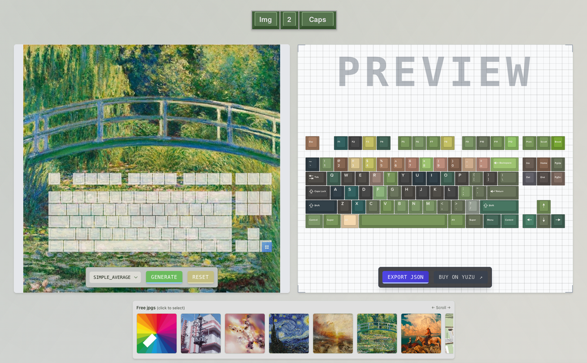

# Img2Caps

A web application that helps keyboard enthusiasts design custom keycap sets based on images. Upload an image, position a keyboard overlay, and generate a custom keycap color scheme extracted from your image.



[Live webapp](https://www.img2caps.app/)

## Features

- Upload your own images or choose from sample images
- Position and resize a keyboard overlay on your image
- Extract color palettes from the image to create a custom keycap design
- Real-time preview of your custom keycap set
- Export a design file compatible with Yuzu KeyCaps for ordering physical custom keycaps
- Responsive design that works on desktop and mobile
- Interactive keyboard preview with "clack" sound effects

## Setup

### Prerequisites

- Node.js 18+ and npm
- Python 3.9+ (for utility scripts)

### Installation

1. Clone the repository
   ```bash
   git clone https://github.com/yourusername/img2caps.git
   cd img2caps
   ```

2. Install JavaScript dependencies
   ```bash
   npm install
   ```

3. Install Python dependencies (optional, only needed for utility scripts)
   ```bash
   pip install -r requirements.txt
   ```

### Development

Start the development server:
```bash
npm start
```

The application will be available at http://localhost:3000

### Building for Production

```bash
npm run build
```

The built files will be in the `build` directory, ready to be deployed to a static hosting service.

## Project Structure

- `/src` - React application source code
  - `/components` - React components
  - `/hooks` - Custom React hooks
  - `/utils` - Utility functions
  - `/assets` - Static assets imported by the application
  - `/data` - JSON data files for keyboard layouts and colors
- `/public` - Static files served directly
  - `/assets` - Public assets like sounds
  - `/data` - Data files accessible to the browser
  - `/images` - Sample images and previews
- `/python_scripts` - Utility Python scripts for data processing
- `/yuzu` - Yuzu keyboard assets and exported designs

## How It Works

1. **Upload an Image**: Start by uploading your own image or selecting one of the sample images.
2. **Position the Keyboard**: Drag and resize the keyboard overlay to capture the colors you want.
3. **Generate Color Scheme**: The app extracts dominant colors from the image and maps them to keycaps.
4. **Preview and Export**: See a real-time preview of your keycap set and export a design file compatible with Yuzu KeyCaps.

## Technical Details

The app uses:
- React with TypeScript for the UI
- Canvas API for image processing and color extraction
- chroma.js for color manipulation
- Tailwind CSS for styling
- Vercel hobby tier hosting
- [Keymason](https://github.com/miragecraft/keymason) for HTML/CSS keys
- Remixed logic from [ColorThief](https://github.com/lokesh/color-thief)

## License

[MIT License](LICENSE)